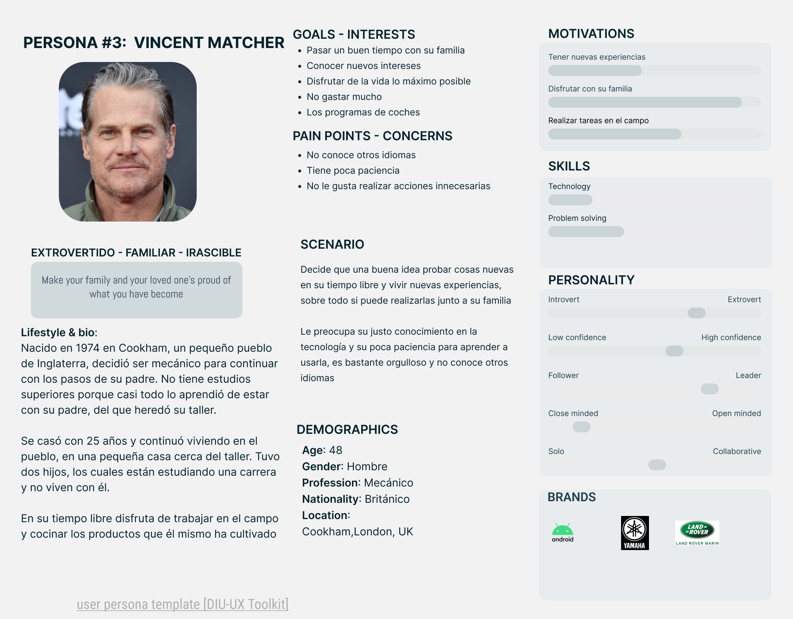

## DIU - Practica 1: Revisión de Usabilidad

### Empathy Map

La página visualmente puede resultar agradable, pero no es una buena web de navegación: los tours están muy desordenados y no es sencillo encontrar el ideal. 
Por otro lado, el proceso de reserva es confuso, dependiendo de dónde se acceda a la reserva redirige a una página o a otra, estando las opciones mal agrupadas.

### Desk research: Análisis Competencia

Hemos elegido **Civitatis** por ser la opción más completa. Tiene bastantes filtros a la hora de buscar un tour, puedes cambiar la moneda y el idioma en cualquier momento y además hay diversas posibilidades de pago. Otro aspecto importante es que puedes crear un usuario para que todo este proceso de reserva sea más sencillo.

### Personas

##### <ins>Teresa Ferrero</ins>

Se trata de un usuario cada vez más común: una persona jubilada que comienza a tener algunos conocimientos tecnológicos y que se atreve a investigar y aprender.
Además, al no trabajar tiene la posibilidad de viajar con más facilidad.
Por contra, algunos de los problemas de la página web puede que no se hagan evidentes para ella debido a su inexperiencia.

##### <ins>Victor García</ins>

Es un usuario más común de la aplicación: no es de la zona, pero conoce el idioma; no es especialmente hábil para manejarse con la tecnología; y busca que sea rápido y sencillo.

##### <ins>Vincent Matcher</ins>

Esta es una persona con algo de conocimiento previo en internet, entonces su proceso de reserva no es muy negativo al ya haberlo hecho más de una vez.
Sin embargo, es extranjero y además conoce poco el idioma, por tanto necesita un poco más de ayuda a la hora de escoger un tour.

#### User Journey Map  (1 por persona)

##### <ins>Teresa Ferrero</ins>

De este modo, en su caso, el Journey Map se centra en el proceso de reserva y en el hecho de que, por norma general, las personas más mayores no quieren complicaciones e ir lo más directas posible por su desconocimiento de las tecnologías (quiere realizar el proceso porque así aprende, pero quiere hacerlo rápido porque es incómodo).
Por esta razón, el hecho de presentar varias opciones (múltiples tours con la misma temática) o de no disponer de métodos de acción (por ejemplo el pago) ya conocidos por el usuario empeoran la experiencia.

##### <ins>Victor García</ins>

En este caso, el journey map no es especialmente negativo, ya que tenemos una persona que al ser más joven y al realizar una tarea sencilla tiene menos dificultades.
Aún así no es especialmente hábil lo que causa que tenga algunos problemas mínimos.

##### <ins>Vincent Matcher</ins>

Al conocer previamente los procesos de reserva por cómo se realizan en otras páginas, su Journey Map se centra sobre todo en el proceso de elección de un tour que se adapte a sus necesidades.
Esto provoca dos conflictos: que la selección de un tour es complicado al no poder contar con criterios de búsqueda de un tour y que además el idioma en inglés no es correcto.

## Revisión de Usabilidad

En nuestro análisis, la web obtiene una puntuación de **58 - Moderate**, que se puede consultar en el [PDF](P1/usability_review_general.pdf) donde se incluyen comentarios a las valoraciones.

En primer lugar y, aunque no recibe una valoración positiva, la página web sí que cumple con el objetivo general de un usuario: realizar una reserva para un tour conociendo los detalles del mismo.
Sin embargo, el principal problema reside en el proceso para realizarlo y la experiencia de navegación por la web.

El primer problema que surge al acceder es que la página no presenta una estructura bien definida: los tours se presentan sin un orden claro y pueden aparecer varias veces, lo que hace que encontrar el elemento deseado sea más complejo.
A esto se suma el hecho de que no incluye un buscador o un filtro para los tours que permita realizar una búsqueda rápida o agrupar los tours según diferentes categorías (precio, tiempo, hora, número de personas, edades recomendadas...).

Por otro lado, también de forma visible desde que se accede, el menú tiene pocas opciones y no es muy intuitivo: las etiquetas tienen nombres poco significativos (lo que no permite ubicarse correctamente/fácilmente dentro de la página) e incluso no se puede ver bien dentro de las páginas de los tours dado que el texto se confunde con las imágenes.

Sin embargo, el mayor problema que presenta se encuentra dentro de los tours: aunque se incluye bastante información, puede haber algunos casos puntuales un poco confusos y los mapas que se proporcionan pueden no funcionar correctamente; pero es el proceso de reserva el gran punto negativo, se trata de un proceso muy poco intuitivo en el que no se establecen unos pasos bien definidos. A esto se suma el hecho de que la reserva es gestionada por una empresa externa con página web propia (se redirige), que no presenta algunos de los métodos de pago más comunes y que el usuario puede perder todos los pasos completados en caso de salirse a mitad del proceso.

Pese a ello, el aspecto visual es correcto, se presenta una página con un estilo moderno y limpio y con el texto bastante legible. Además, la información de contacto es bastante visible (barra superior de la página) y se puede encontrar también en la parte inferior de la página (sitio común).

En resumen, la página puede presentar algunos puntos positivos, sin embargo, la gran cantidad de errores de diseño y complicación de los procesos que realiza el usuario hacen que la experiencia se vea muy perjudicada.
