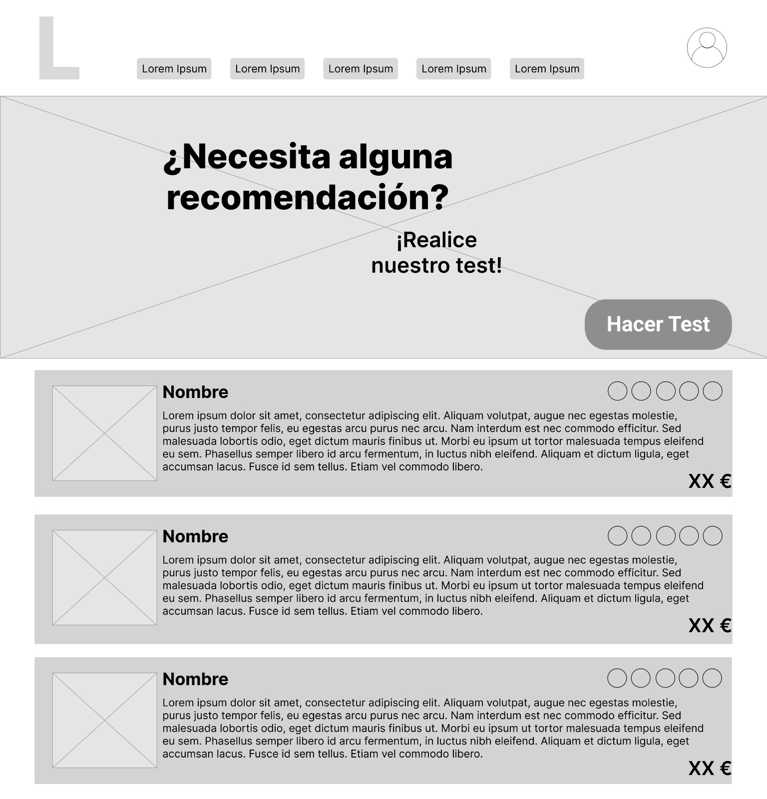
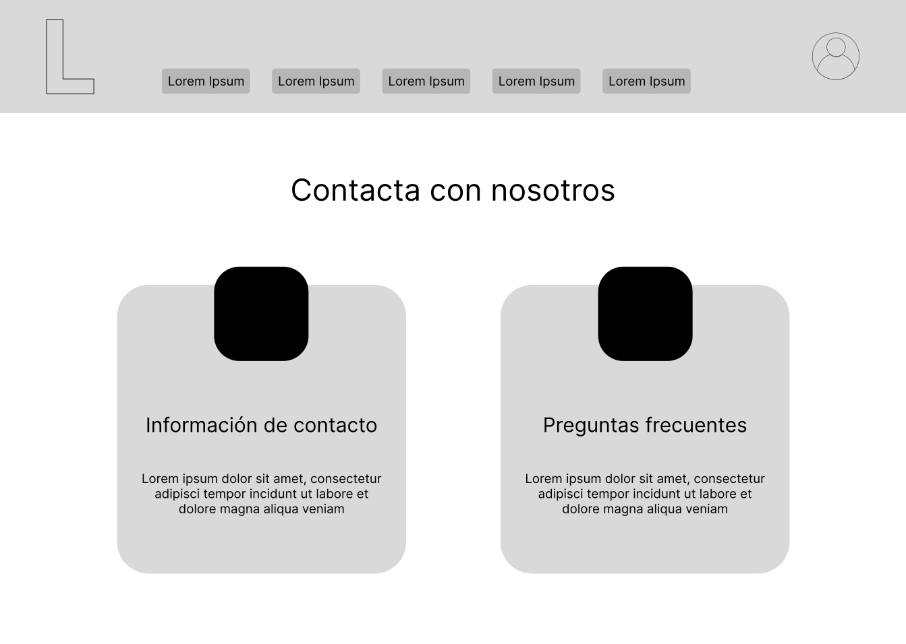
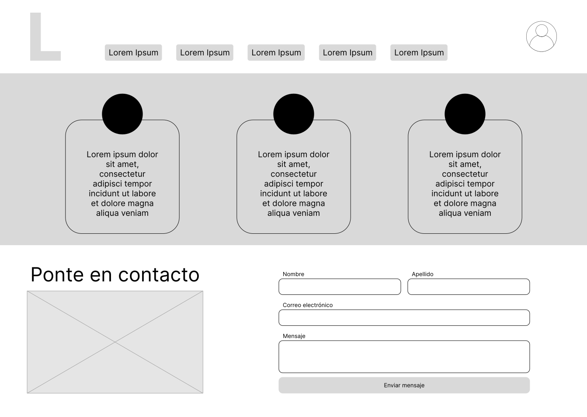
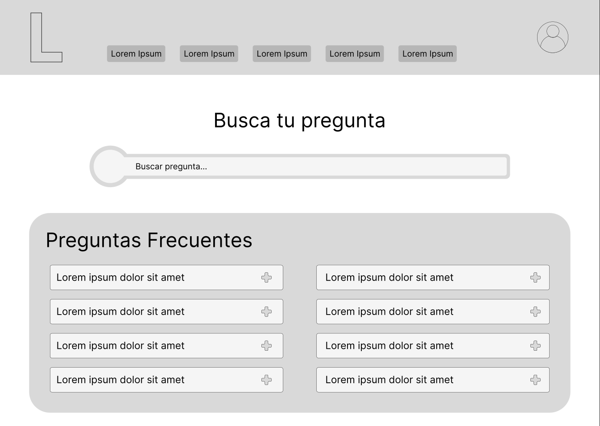
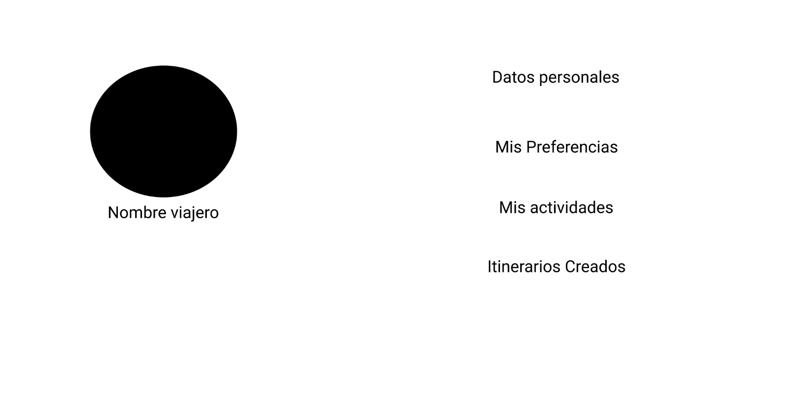
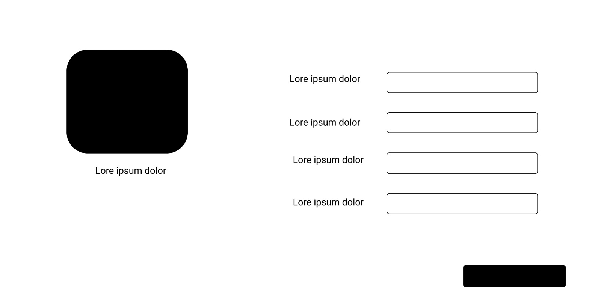
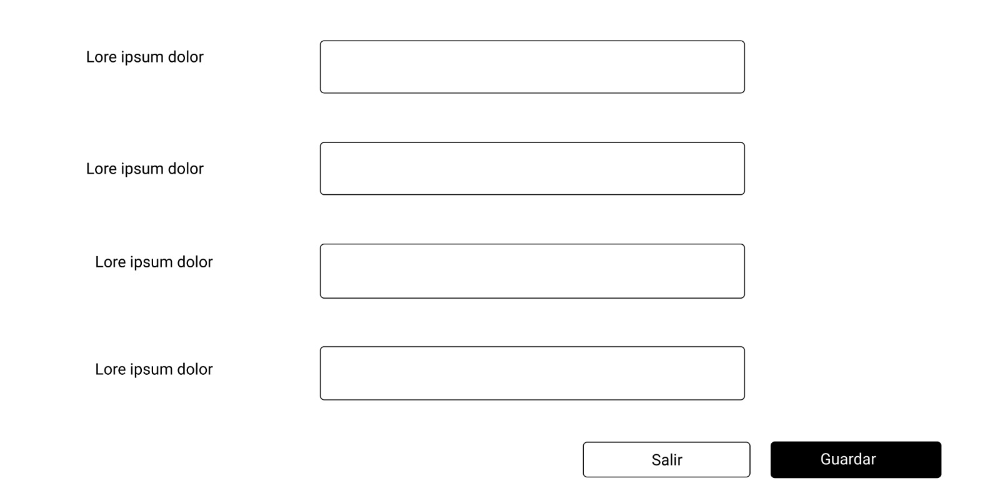
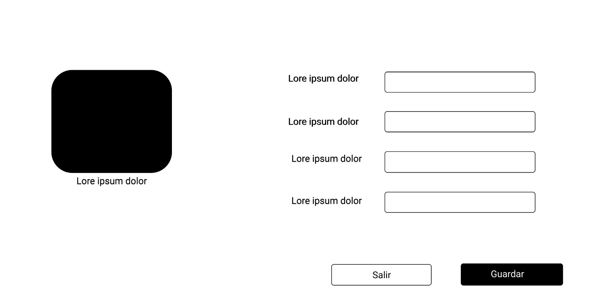
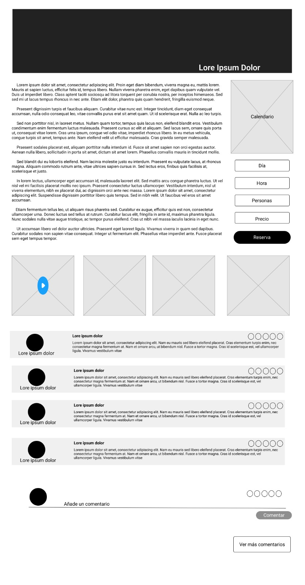
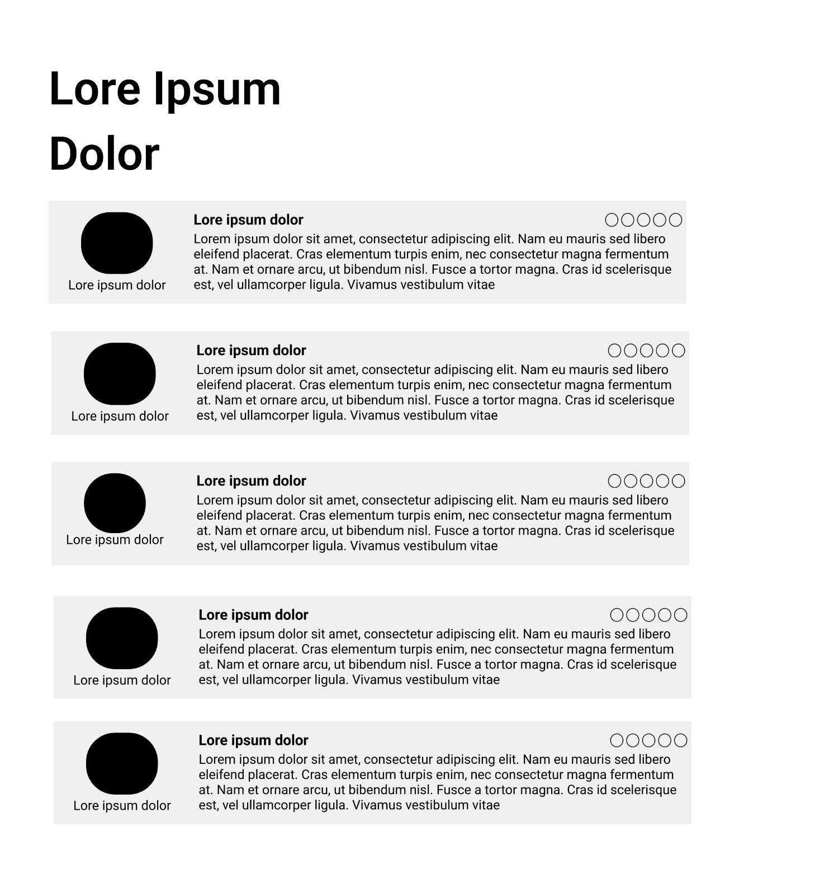

## DIU - Practica2

### IDEACIÓN

* Malla receptora de información 

En este apartado analizamos las mejores características de los competidores, así como sus deficiencias, a lo que sumamos nuestras propuestas personales.

* Point of View 

### PROPUESTA DE VALOR: Where2Go

En esta práctica proponemos una aplicación que permita a los usuarios, no solo consultar y reservar tours por Granada, sino también la posibilidad de formar una comunidad global para organizar itinerarios personalizados. Además, se incluye un recomendados para aquellos usuarios indecisos, lo que permite obtener un resultado rápido a partir de unas preguntas sencillas.

* ScopeCanvas

### TASK ANALYSIS

* User Task Matrix 

En este apartado vamos a analizar las tareas más importantes que realizan los usuarios en la aplicación así como la relevancia que cada grupo de posibles usuarios da a cada una de ellas para determinar las que tendrán que ser implantadas antes y con una calidad mayor.

### ARQUITECTURA DE INFORMACIÓN

Esta sección muestra la estructura de la aplicación tras realizar el análisis de las tareas que se deben implementar y las funcionalidades que incluirá una vez finalizada. Esto permite entender mejor el funcionamiento de cada una de las secciones.

* Sitemap 

* Labelling 

### Prototipo Lo-FI Wireframe
#### Página Principal

#### Página de información del sitio y recomendaciones

#### Página de la comunidad de usuarios

- Itinerarios

- Crear itinerarios

- Itinerario (creador)

- Itinerario (usuario - no creador)

#### Página de ayuda en línea

- Página inicial

- Página de contacto

- Preguntas frecuentes

#### Página de viajero

- Viajero

- Nuevo viajero

- Preferencias

- Datos personales

#### Página tour

- Tour

- Comentarios del tour

### Conclusiones  

Como ya se ha mencionado, Where2Go es una aplicación de reserva de tours que implementa algunas funcionalidades adicionales que dan valor a la propuesta:

- Gestión de usuarios: se implementa un sistema de usuarios que permite que estos puedan gestionar mejor las actividades que han realizado además de las pendientes, aportando comodidad en toda la experiencia en la aplicación. En cualquier caso, no será un requisito crear un usuario para poder realizar algunas de las actividades de la aplicación.

- Recomendador de tours: se incluye un recomendador que proporciona al usuario los tours más adecuados según sus preferencias. El sistema obtiene esta información del usuario (lógico) almacenado en la base de datos o, si no lo tiene (o no ha iniciado sesión), de un formulario con una serie de preguntas que determinan las preferecias.

- Tours: cada tour incluirá información detallada sobre la actividad que se realizará e incluirá una sección para realizar la reserva en pocos pasos y de forma intuitiva.

- Comunidad de usuarios: se trata de un espacio donde cada usuario (debe haber creado un usuario en la aplicación) puede añadir su propuesta para realizar un itinerario por cualquier zona de la ciudad, o bien, consultar y apuntarse a los que otros usuarios ya hayan creado.

- Itinerarios: creados por los usuarios, incluyen información sobre la actividad que se va a realizar, de forma que cualquier otro usuario que desee apuntarse pueda informarse sobre el itinerario. Adicionalmente, se incluye un foro en el que los usuarios pueden interaccionar y comunicarse antes y después de concluir la actividad.
