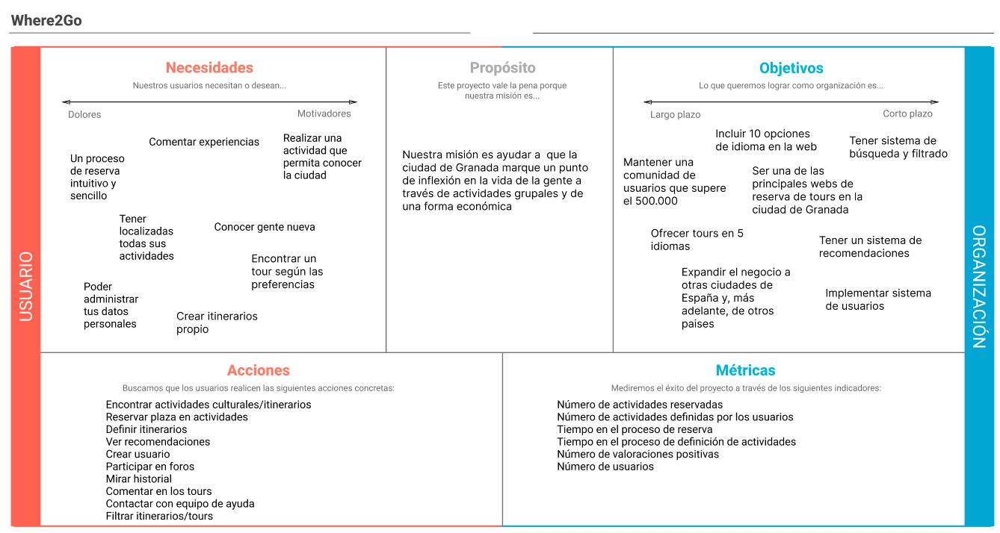

## DIU - Practica2, entregables

### Ideación 
* Malla receptora de información 
* Mapa de empatía
* Point of View 

### PROPUESTA DE VALOR
* ScopeCanvas

### TASK ANALYSIS

* User Task Matrix 

### ARQUITECTURA DE INFORMACIÓN

* Sitemap 
* Labelling 

### Prototipo Lo-FI Wireframe 

### Conclusiones  
(incluye valoración de esta etapa)
