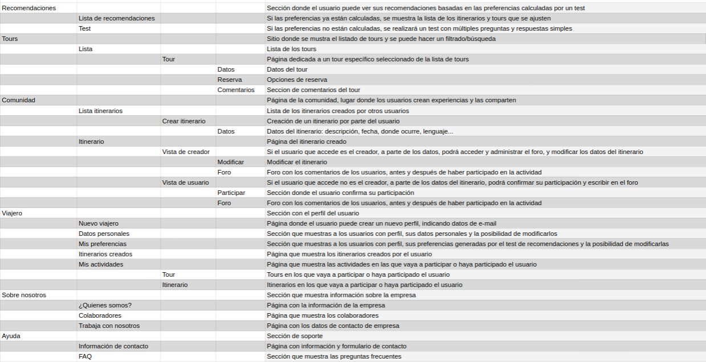
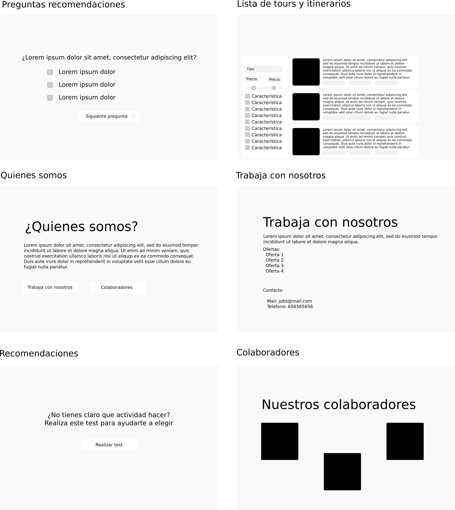

## DIU - Practica2, entregables

### IDEACIÓN

* Malla receptora de información 

* Point of View 

### PROPUESTA DE VALOR
* ScopeCanvas

### TASK ANALYSIS

* User Task Matrix 

### ARQUITECTURA DE INFORMACIÓN

* Sitemap 

* Labelling 

### Prototipo Lo-FI Wireframe 

- Itinerarios

- Crear itinerarios

- Itinerario (creador)

- Itinerario (usuario - no creador)

### Conclusiones  
(incluye valoración de esta etapa)
