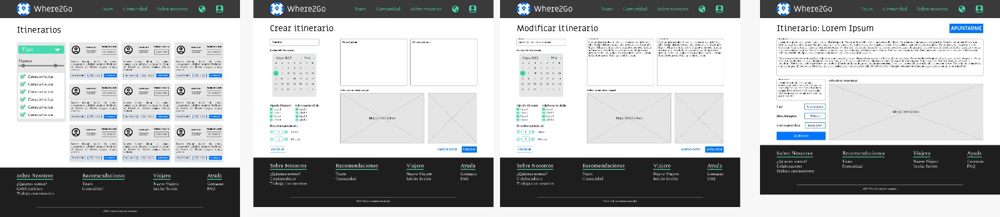
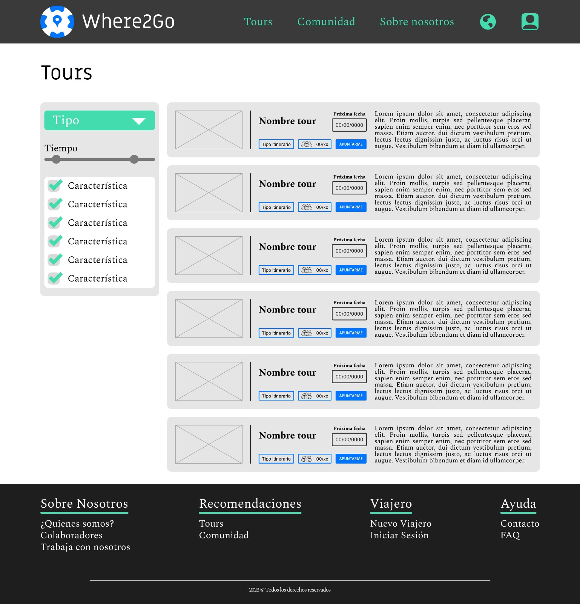

# DIU - Practica 3: Where2Go

Este proyecto presenta una página en la que se ofrece al usuario la posibilidad de reservar tours por la ciudad. Sin embargo, cuenta con algunas funcionalidades adicionales que permiten que este usuario se involucre más en las actividades y, como resultado, las disfrute más:

- Un recomendador por medio de un sencillo cuestionario ofrece al usuario diferentes alternativas para realizar visitas de acuerdo a sus gustos, preferencias en ese momento y espectativas sobre la actividad que busca.
- Un espacio en el que toda la comunidad de viajeros puede crear itinerarios personalizados y quedar para realizarlos en grupo.

Además de estas características, se ofrece una sección de ayuda y de contacto con la empresa para resolver dudas de los clientes o para aquellos que buscan trabajar con la empresa. Adicionalmente, la página está disponible en diferentes idiomas y permite calcular precios en diferentes divisas, haciéndola accesible a un mayor número de personas.

## Moodboard (diseño visual + logotipo)   

En el moodboard se encuentra una estructura general de las ideas que queremos comunicar en nuestra página web. 

Hemos buscado algunas imágenes de inspiración para nuestro proyecto, uno de los elementos que hemos considerado principales es la cerámica granadina y sus colores, de los que hemos obtenido la paleta de color principal para nuestro diseño. También presentamos la tipografía a emplear proponiendo dos fuentes:

- Una fuente más informal sin *serif* que será empleada en títulos y cabeceras.
- Una fuente con *serif* empleada en el contenido general del sitio.

Nuestro proyecto cuenta con dos eslóganes, uno en inglés y su traducción en español: ***"We know where 2 go. Sabemos dónde ir"***.

También cabe destacar el logo, en el que hemos mezclado el diseño de la cerámica granadina con lo que se puede asemejar a una brújula con un icono de localización.

## Landing Page

En nuestra *Landing Page* hemos incluido los elementos necesarios para dar una primera aproximación a los visitantes de lo que se pueden encontrar en nuestra página web.

En un primer vistazo, el objetivo es que el visitante vea centrada su atención en un recomendador de actividades (por medio de un breve cuestionario), lo que hace que nuestra página se diferencie de las otras adaptándose a las necesidades de cada persona, por eso el botón de recomendaciones se encuentra en la parte principal y que primero se ve de la *Landing Page*.

Más allá de este elemento, se incluye un menú superior que permite al usuario navega cómodamente por el sitio.

A continuación se muestra un carrusel de comentarios con las valoraciones de las experiencias de nuestros usuarios, seguido de algunas de las funcionalidades destacables de nuestro proyecto que lo hacen distinto a los demás y permiten al usuario, de forma rápida obtener una percepción de lo que se va a encontrar en el sitio una vez comience a navegar, son el test explicado anteriormente y la inclusion de una serie de actividades de la comunidad (personas registradas where2go pueden crear sus propios itinerarios en los que se puede unir otros usuarios registrados) así como la inclusión de un foro que permite conectar con otros usuarios

Por último, el footer y el header permite viajar directamente a nuestra página web

## Mockup: LAYOUT HI-FI

#### Itinerarios

Esta parte muestra los diseños para la sección de Itinerarios (Comunidad):

**1. Lista de itinerarios con filtro:** se muestra como un *grid* de cartas en el que cada itinerario contiene una pequeña descripción y algunos de los datos más relevantes indicados (creador, fecha del itinerario, tipo de itinerario, número de participantes y un botón para apuntarse).
**2. Creación de un itinerario:** se ofrece un formulario para rellenar los campos que describan el itinerario junto con un mapa para marcar la ruta.

En este Layout hemos usado los siguientes guidelines:

#### Filtros

https://pencilandpaper.io/articles/ux-pattern-analysis-enterprise-filtering/#sidebar
Hemos creado un filtro basándonos en un filtro lateral, ya que tiene una gran escalabilidad, permitiendo añadir diferentes número de valores según las necesidades de cada página. Sin embargo afecta a la página entera, ya que no solo hay que dejar un espacio lateral para que se incluya, si no que cada elemento de la página se ve afectado por los valores que se escogen.

#### Botones

https://m1.material.io/components/buttons.html#
Los diferente tipos de botones los hemos obtenido siguiendo esta guía, que muestra tanto cómo se tienen que ver como dónde hay que colocarlos

#### Registro de cuenta

https://ui-patterns.com/patterns/AccountRegistration
Este patrón se ha usado en las páginas para crear un nuevo usuario, registrarse y modificar los datos de un usuario registrado. 
Se ha tenido en cuenta que el diseño sea lo más fácil posible, incluyendo la información mínima necesaria para crear una cuenta, pudiendo cambiar cualquier dato que se haya asociado a ella (menos el cumpleaños).
Además, se establece un sistema de 'ayuda', donde cuando no se entienda qué información se debe introducir o cómo, se muestra un ejemplo

#### Calendario

https://ui-patterns.com/patterns/CalendarPicker
Se ha usado el patrón de 'Seleccionar en calendario'  para que se haga más fácil al usuario introducir una fecha a la hora de elegir un día para el tour.
Cuenta con atajos para cambiar de mes más facilmente, y se rellena directamente la fecha en el botón de abajo. También se muestra semanas completas aún cuando el mes no empieza o acaba en esa semana

#### Carrusel de imágenes
https://ui-patterns.com/patterns/Carousel
Se ha optado usar un carrusel de imágenes ya que permite navegar por una serie de imágenes sin que estén todas en pantalla, y aporta flexibilidad, ya que pueden haber tours que no cuenten con las mismas imágenes que otros

## Documentación: Publicación del Case Study
Nuestro equipo ha seguido un desarrollo del trabajo bastante adecuado, ya que nos hemos sabido dividir el trabajo entre todos los integrantes y hemos sido capaces de generar una página web completa sin que el estilo de cada una de las páginas varie demasiado entre ellos, además de introducir distintos guidelines

El único problema relevante es que, en el caso de el guideline de los filtros, no ha sido posible encontrar mucha información detallada a como se ha de diseñar uno, pero aun así se ha podido lograr 

 
