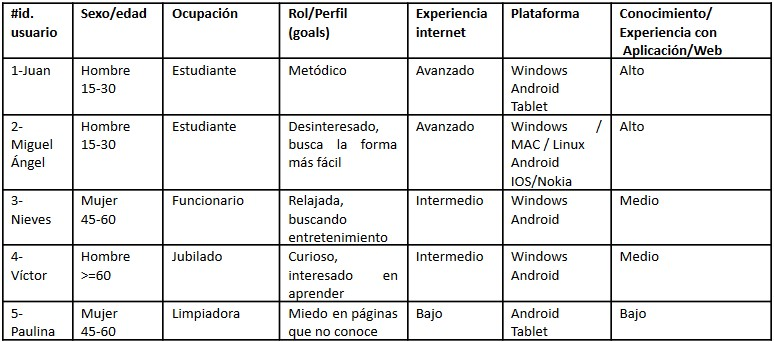
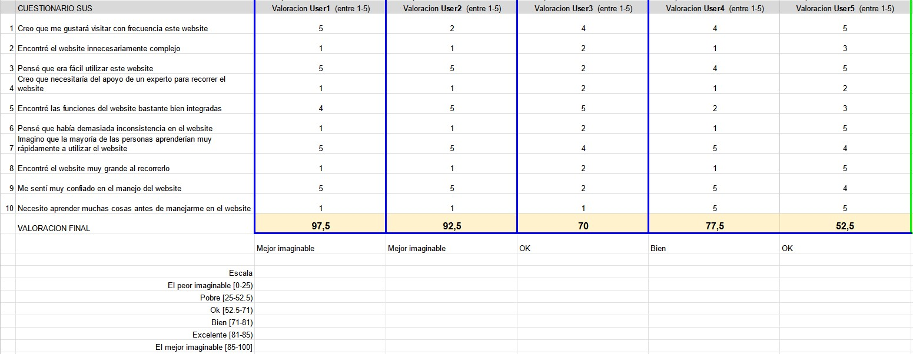
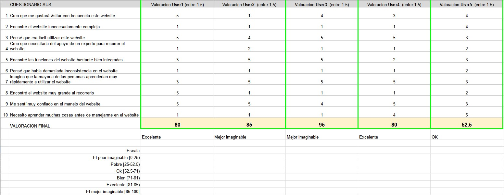

# DIU - Practica 4: A/B Testing y Cuestionario SUS

En esta práctica realizamos un A/B Testing entre el diseño de [@Dunno](https://github.com/YarasAtomic/DIU) (Opción **A**) y [@LosEpsilonDelta](https://github.com/AlvaroRodriguezGallardo/DIU) (Opción **B**).

La primera es una página para realizar reservas para talleres de cerámica que incluye una tienda online para adquirir piezas de cerámica. Por otro lado, la segunda es una página de reservas de tours por Granada que incluye un recomendador y un espacio en el que los usuarios pueden proponer y realizar sus propios itinerarios.

### Usuarios

Para realizar los test se ha buscado usuarios reales que evalúen ambas páginas, de esta forma se logra objetividad e imparcialidad a la hora de evaluar ambos diseños. En cualquier caso, dicho test se ha realizado de forma guiada por cada integrante del grupo para poder obtener los datos y opiniones más precisas posibles de ambas opciones. Los usuarios son:

### Tareas realizadas

Para evaluar el diseño se han elegido algunas opciones que se permiten realizar en la opción **B**:
- Comprar un producto.
- Reservar un taller según el propio nivel de la persona.
- Realizar una visita virtual.
- Contactar con la empresa.
- Mirar galería y buscar cierto tipo de elemento (filtros).

Se ha pedido a los usuarios que realicen estas acciones para comprobar si son capaces de realizarlas o se pierden en cualquier momento.

## Elección y características

### A/B Testing

Para recabar información para el test, se ha realizado un formulario a los diferentes usuarios, de forma que, para el test **A** se han obtenido los siguientes resultados:

Por otro lado, para el test **B** se han obtenido los siguientes resultados:

Como vemos, ambos casos han obtenido una puntuación global muy positiva, sin emabrgo hay algunas diferencias que hacen que cada uno destaque en aspectos diferentes:
- El primer caso llama la atención por su simplicidad frente al segundo, en el que el elevado número de páginas y secciones hacen que los usuarios se sientan un poco perdidos.
- El segundo caso destaca por la cantidad de información presentada a los usuarios y la completitud de las acciones que se pueden realizar frente al primero que evita el detalle de los elementos.

### Usability Report de Caso B

Finalmente, se ha realizado un análisis en mayor detalle de la opción **B**, donde se describe la funcionalidad principal diseñada, junto con una descripción de las opiniones obtenidas de los usuarios a partir del *Test SUS*, describimos, además, la metodología empleada al realizarlos. También se ofrece en el documento una recopilación de las recomendaciones obtenidas de los usuarios y de nuestra experiencia personal al observar con detenimiento la aplicación.

Toda esta información se puede obtener en [este documento](P4_UsabReport_Artesania_Nazari_doneby_DIU2_DUNNO.pdf).

### Conclusiones

En esta práctica hemos realizado el A/B Testing a dos opciones de diseño para dos aplicaciones diferentes, esto nos ha permitido observar las ideas de otros grupos así como detectar los errores que hemos podido cometer en nuestro propio diseño. En cualquier caso, hemos podido obtener algunas conclusiones en conjunto de ambas páginas con la ayuda de diferentes usuarios a través del *Test SUS*.

En cuanto a la página de artesanía, en general, presenta un diseño agradable que hace que los usuarios se sientan cómodos navegando por ella, esto no ha sido un problema tampoco para nuestro diseño, sin embargo, la simplicidad y el hecho de contar con pocas páginas que pueden entrelazar mucho el contenido ayuda a que los usuarios realicen las operaciones deseadas de una forma rápida, fácil e intuitiva, lo que si que puede proporcionar una ventaja de la opción **B** frente a la **A**.

Sin embargo, esta simplicidad puede ponerse en contra cuando el usuario busca algo más de información sobre ciertos elementos del sitio. De este modo, es importante encontrar el equilibrio entre cantidad de información y simplicidad de las operaciones.
