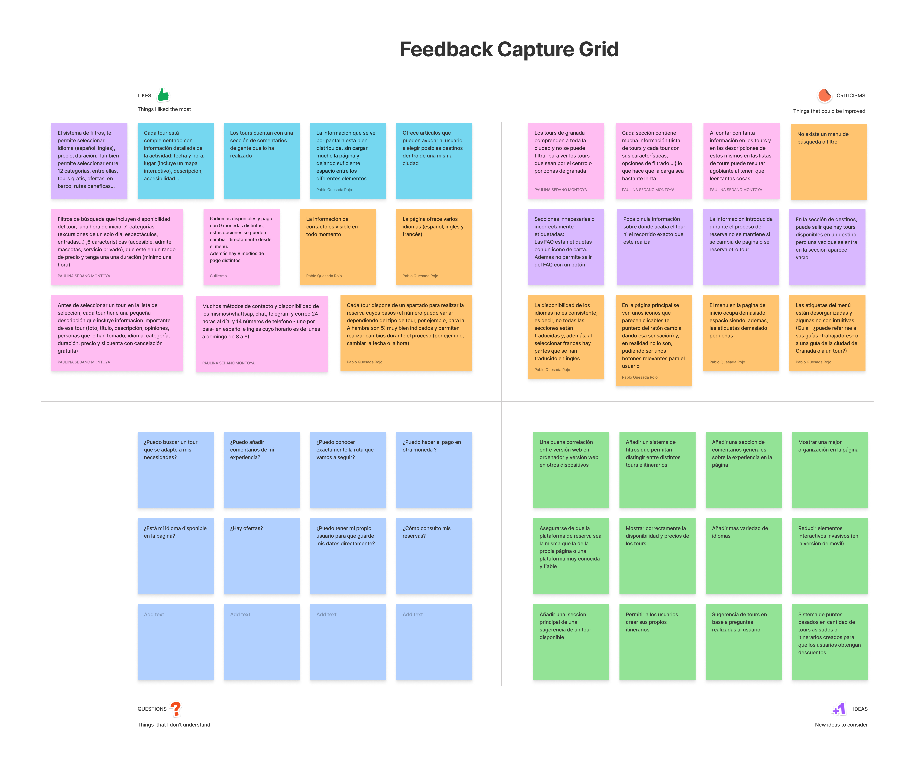
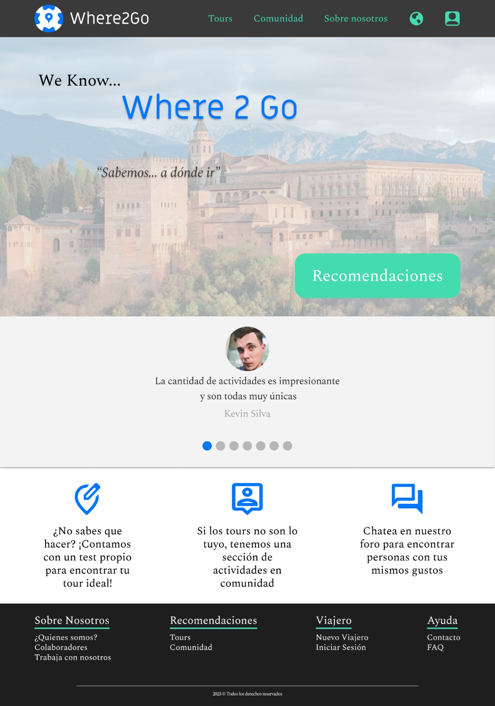

# DIU23
Prácticas Diseño Interfaces de Usuario 2022-23 (Tema: Free Tour) 

Grupo: DIU2.Dunno.  Curso: 2022/23 
Updated: 22/03/2023

Proyecto:
>>> Where2go

Descripción:
>>> Una web que ofrece la posibilidad de crear tus propios itinerarios de ativadades por Granada y compartirlos. A parte, incluye sus propias actividades y un detallado sistema de recomendaciones

Logotipo:

Miembros
 * :bust_in_silhouette:  Pablo Quesada Rojo [@pabloqr](https://github.com/pabloqr)
 * :bust_in_silhouette:  Paulina Sedano Motoya [@MissK0u](https://github.com/MissK0u)
 * :bust_in_silhouette:  Guillermo Medialdea Burgos [@YarasAtomic](https://github.com/YarasAtomic)

---
Boceto HI-FI:
>>> https://www.figma.com/proto/6NM0Xleb3hsISxHpgTG1rS/Layout-Hi-Fi-%5BGeneral%5D?node-id=1-2&starting-point-node-id=1%3A2

# Proceso de Diseño 

## Paso 1. UX Desk Research & Analisis 

###  1.a Competitive Analysis

Comparamos la web proporcionada [Free Tour Granada](https://freetour-granada.com/) con:
- [Granada Tours](https://granadatours.com.es/): se trata de una opción que, como la proporcionada es mejorable en algunos de sus aspectos.
- [Yoorney - Granada](https://toursgratis.com/granada): se trata de una opción algo mejor que la proporcionada, pero que también tiene algunos aspectos mejorables.
- [Civitatis - Granada](https://www.civitatis.com/es/granada/): se trata de una opción mucho mejor que la proporcionada, con muchas más opciones y una funcionalidad mejor implementada.

###  1.b Persona

Se han creado diferentes perfiles de persona, lo que permite analizar con una mayor profundidad la funcionalidad de la web.

#### Teresa Ferrero

Es una mujer jubilada que le encanta pasar tiempo con su familia y prefiere dedicar su tiempo libre a seguir aprendiendo.
Junto con su marido, realizan viajes por España para conocer la riqueza del país.

<!-- img src="P1/persona_1.png" -->

---

#### Victor García

Se trata de un joven que le gusta disfrutar en la naturaleza, pero que está cansado de su trabajo.
Por esta razón, quiere aprovechar para hacer una escapada con su pareja.

<!-- img src="P1/persona_2.png" -->

---

#### Vincent Matcher

Es un turista inglés de mediana edad, con una vida ya asentada junto a su mujer y sus hijos.
Está totalmente dedicado a su trabajo y, por ello, viaja a España para desconectar y reconciliarse con su familia.

<!-- img src="P1/persona_3.png" -->

---

###  1.c User Journey Map

En las historias de usuario se han tratado casos prototípicos según los perfiles de las personas creadas.

#### Teresa Ferrero

Su caso es el de una mujer más mayor con pocos conocimientos sobre tecnología pero que se atreve a investigar y probar.
Por este motivo, su objetivo al realizar la reserva es finalizarla lo más rápido posible y con las etapas lo más claras posible.

<!-- img src="P1/journey_map_1.jpeg" -->

---

#### Victor García

Aunque su conocimiento acerca de tecnologías bajo no represente un perfil tan común, sí que lo es el hecho de ser una persona que le gusta aventurarse y conocedora del lenguaje.
Como turista nacional, su objetivo a la hora de realizar la reserva es poder hacerla fácilmente y poder informarse detalladamente acerca del tour.

<!-- img src="P1/journey_map_2.jpeg" -->

---

#### Vincent Matcher

Este sí es un caso muy común, un turista extranjero que busca realizar una actividad cultural en la ciudad.
De este modo, su objetivo es poder realizar el proceso en su idioma nativo y conocer fácilmente a la ubicación del tour.

<!-- img src="P1/journey_map_3.jpeg" -->

---

###  1.d Usability Review

En nuestro análisis, la web obtiene una puntuación de **58 - Moderate**, que se puede consultar en el [PDF](P1/usability_review_general.pdf) donde se incluyen comentarios a las valoraciones.

La página no presenta una estructura bien definida, lo que hace que encontrar el elemento deseado sea más complejo.
A esto se suma el hecho de que no incluye un buscador o un filtro para los tours y poder agruparlos según su precio, temática…

Por otro lado, el menú tiene pocas opciones y no es muy intuitivo: tiene etiquetas con nombres no muy significativos y no permite ubicarse correctamente dentro de la página.

Pese a ello, el aspecto visual es correcto y el botón de contacto es bastante visible e intuitivo (símbolo de WhatsApp).

En resumen, la página puede presentar algunos puntos positivos, sin embargo, la gran cantidad de errores de diseño y complicación de los procesos que realiza el usuario hacen que la experiencia se vea muy perjudicada.

---

## Paso 2. UX Design  

 2.a Feedback Capture Grid / EMpathy map / POV
---

>>> Comenta con un diagrama los aspectos más destacados a modo de conclusion de la práctica anterior,

En el trabajo realizado en la práctica anterior, hemos descubierto que elementos de una aplicación pueden considerarse críticos por parte de los usuarios, y que elementos son los que los desarrolladores dejan mas de lado. Esto es aplicable, al tipo de servicio que ofrece la aplicación, que suelen ser bastante similares y poco novedosos.

 2.b ScopeCanvas
----

Where2Go es una web que pretende acercar Granada a las personas ofreciendo una gran variedad de tours.
Como caracteristica destacable, Where2Go ofrece a las personas la oportunidad de realizar actividades y compartirlas con el resto de personas con el objetivo de realizar ocio alternativo y de forma social.
Además la web incluirá un sistema de recomendaciones personalizadas faciles de usar y administrar.

 2.b Tasks analysis 
-----

Para calcular la importancia de las tareas dentro de la aplicación, hemos realizado una Task Matrix, ya que recoge una gran cantidad de información usando pocos parametros. Además de que permite facilmente ordenar la importancia de los elementos.

 2.c IA: Sitemap + Labelling 
----

 2.d Wireframes
-----

## Paso 3. Mi UX-Case Study (diseño)

 3.a Moodboard
-----

>>>El icono se ha diseñado usando inkscape. Se ha utilizado una resolución 1024x1024, dado su alto nivel de densidad y su proporción estandar. Este icono sirve en multiples entornos, como redes sociales, o publicidad. Dispone de solo 2 colores (uno es el blanco), lo cual hace que sea facil cambiarlos y adaptarlos a mas situaciones.

  3.b Landing Page
----

 3.c Guidelines
----

Botones: https://m1.material.io/components/buttons.html#buttons-button-types
Filtros: https://ui-patterns.com/patterns/LiveFilter
https://pencilandpaper.io/articles/ux-pattern-analysis-enterprise-filtering/#sidebar
Registro de cuenta: https://ui-patterns.com/patterns/AccountRegistration
Calendario: https://ui-patterns.com/patterns/CalendarPicker
Carrusel de imágenes: https://ui-patterns.com/patterns/Carousel

  3.d Mockup
----

 3.e ¿My UX-Case Study?
-----

<!-- <video width="320" height="240" controls>
  <source src="P3/simulacion.mp4" type="video/mp4">
</video> -->
Video de la simulación:

## Paso 4. Evaluación 

 4.a Caso asignado
----

>>> Breve descripción del caso asignado con enlace a  su repositorio Github

 4.b User Testing
----

>>> Seleccione 4 personas ficticias. Exprese las ideas de posibles situaciones conflictivas de esa persona en las propuestas evaluadas. Asigne dos a Caso A y 2 al caso B
 

| Usuarios | Sexo/Edad     | Ocupación   |  Exp.TIC    | Personalidad | Plataforma | TestA/B
| ------------- | -------- | ----------- | ----------- | -----------  | ---------- | ----
| User1's name  | H / 18   | Estudiante  | Media       | Introvertido | Web.       | A 
| User2's name  | H / 18   | Estudiante  | Media       | Timido       | Web        | A 
| User3's name  | M / 35   | Abogado     | Baja        | Emocional    | móvil      | B 
| User4's name  | H / 18   | Estudiante  | Media       | Racional     | Web        | B 

. 4.c Cuestionario SUS
----

>>> Usaremos el **Cuestionario SUS** para valorar la satisfacción de cada usuario con el diseño (A/B) realizado. Para ello usamos la [hoja de cálculo](https://github.com/mgea/DIU19/blob/master/Cuestionario%20SUS%20DIU.xlsx) para calcular resultados sigiendo las pautas para usar la escala SUS e interpretar los resultados
http://usabilitygeek.com/how-to-use-the-system-usability-scale-sus-to-evaluate-the-usability-of-your-website/)
Para más información, consultar aquí sobre la [metodología SUS](https://cui.unige.ch/isi/icle-wiki/_media/ipm:test-suschapt.pdf)

>>> Adjuntar captura de imagen con los resultados + Valoración personal 

 4.d Usability Report
----

>> Añadir report de usabilidad para práctica B (la de los compañeros)

>>> Valoración personal 

>>> ## Paso 5. Evaluación de Accesibilidad  (no necesaria)

>>>   5.a Accesibility evaluation Report 
>>>> ----

>>> Indica qué pretendes evaluar (de accesibilidad) sobre qué APP y qué resultados has obtenido 

>>> 5.a) Evaluación de la Accesibilidad (con simuladores o verificación de WACG) 
>>> 5.b) Uso de simuladores de accesibilidad 

>>> (uso de tabla de datos, indicar herramientas usadas) 

>>> 5.c Breve resumen del estudio de accesibilidad (de práctica 1) y puntos fuertes y de mejora de los criterios de accesibilidad de tu diseño propuesto en Práctica 4.

## Conclusión final / Valoración de las prácticas

>>> (90-150 palabras) Opinión del proceso de desarrollo de diseño siguiendo metodología UX y valoración (positiva /negativa) de los resultados obtenidos  

